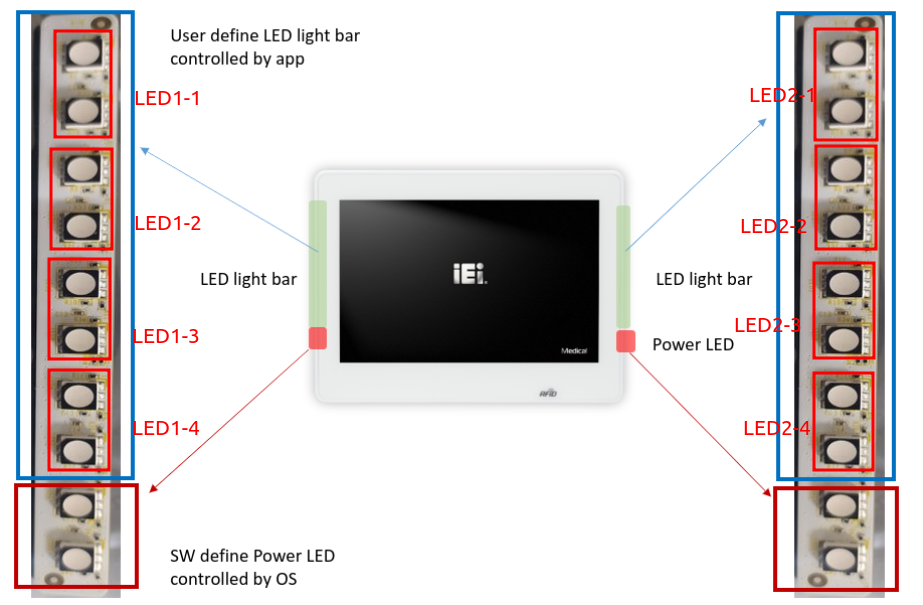

# SDK for the Light-Bar on IEI Android OS
[](https://www.ieiworld.com)
[]([https://www.gnu.org/licenses/old-licenses/gpl-2.0.en.html](https://raw.githubusercontent.com/ieiDroidCommunity/lightbar_sdk_aosp/main/LICENSE))

****
## Contents
* [Overview](#Overview)
* [JNI Library API definition](#jni-library-api-definition)
    * JNI structure
    * setLightBarUserLED
    * clearLightBarLED
    * setLightBarBreathMode
    * setLightBarWaveMode
    * setLightBarPowerLedSuspendColor
    * setLightBarPowerLedPoweroffState
* [How to import JNI to Android Studio](#how-to-import-jni-to-android-studio)
    * Import to CMAKE configuration
    * Bridge to Java project
    * Bridge to Kotlin project
    * Security 


* [Frequently Asked Questions](#frequently-asked-questions)


****
### Overview
-----------
This documentation is focus on JNI API definition of Light-Bar control for IEI IASO-W10B-IMX8M product.
Users can import this JNI library and calling API to implement selfs own apps, so we also provide an instruction about how to import library.

Support list:
|Device Under Test|Target OS| Revision| Status|
|---|---|---|---|
|IASO-W10B-IMX8M| Android 12|B664-12-R202 and above |&#10004;|
|IASO-W10B-IMX8M| Android 13|Coming soon|WIP|

API Features:
* Setting color for one set User-LED with 65535 colors
* Setting User-LED of Two light-bar as breath mode with a specific color
* Setting User-LED Two light-bar as wave mode with a specific color
* Setting a specific blinking color of suspend mode for Power-LED
* Setting 'turn on' or 'turn off' red color for Power-LED in power-off mode

LED defition as follows figure:



****
### <a name="jni-library-api-definition">JNI Library API definition</a>
-----------

#### JNI structure
 
|File|Revision|Description|
|---|---|---|
|LightBar.cpp | 1.0| Android Studio based JNI Native library souce for JAVA/Kotlin programming|


#### 1. setLightBarUserLED
It’s an useful API for one User-LED setting directly, note that calling this API can config one LED set at the same time, so user can implement a loop to calling multiple LED set such as for loop.


Prototype:
    
    setLightBarUserLED(JNIEnv *env, jobjec thiz, jint bar_num, jint led_num, jint red_brightness, jint green_brightness, jint blue_brightness)
    
    - Input argument 1: bar_num with int type
    IASO-W10B-IMX8M has two light-bars, choose 1st light-bar or 2nd light-bar is necessary, so input value is "1" or "2".
    - Input argument 2: led_num with int type
    As above figure, every red border is one LED set, so input value is the one of "1" to "4".
    - Input argument 3: red_brightness with int type
    Select red LED color, value is from "0" to "100"
    - Input argument 4: green_brightness with int type
    Select green LED color, value is from "0" to "100"
    - Input argument 5: blue_brightness with int type
    Select blue LED color, value is from "0" to "100"
   
Example: setting 2nd light-bar and LED1-1 as blue light with 100% brightness, user can calling API as follows:
   
   
    setLightBarUserLED("2", "1", "blue", "100");


#### 2. clearLightBarLED
An useful API which can clear all USER-LED status to "turn off" status.

Prototype:
    
    clearLightBarLED(JNIEnv *env, jobject thiz)
    

#### 3. setLightBarBreathMode
Force User-LED of two light-bar into breath mode with one time period, if developer wants to running breath mode infinity, please create a service with thread first, and calling this api in a loop of thread. 

Prototype:
    
    setLightBarBreathMode(JNIEnv *env, jobject thiz, jstring specific_color)
    
    - Input argument 1: specific_color with string type
    a string prototype with color name as follows support list: “red”, “green”, “blue”, “yellow”, “cyan”, “magenta”, “white”, default color is "blue"

Live Demo:


    
    
#### 4. setLightBarWaveMode
Force User-LED of two light-bar into wave mode with one time period, if developer wants to running wave mode infinity, please create a service with thread first, and calling this api in a loop of thread. 

Prototype:
    
    setLightBarWaveMode(JNIEnv *env, jobject thiz, jstring specific_color)
    
    - Input argument 1: specific_color with string type
    a string prototype with color name as follows support list: “red”, “green”, “blue”, “yellow”, “cyan”, “magenta”, “white”, default color is "blue"

Live Demo:


#### 5. setLightBarPowerLedSuspendColor
It's one of features API which can setting Power-LED color when system into suspend mode, default behavior is blue color with blinking in kernel space. Note that after calling this API, it must be reboot system, kernel space will load new configuration and keep this state until user change it again.

Prototype:
    
    setLightBarPowerLedSuspendColor(JNIEnv *env, jobject thiz, jstring specific_color)
    
    - Input argument 1: specific_color with string type
    a string prototype with color name as follows support list: “red”, “green”, “blue”, “yellow”, “cyan”, “magenta”, “white”, default color is "blue"


#### 6. setLightBarPowerLedPoweroffState
It's one of features API which can setting Power-LED turn on or turn off, default behavior is red color with dimming in kernel space. Note that after calling this API, it must be reboot system, kernel space will load new configuration and keep this state until user change state again.

Prototype:
    
    setLightBarPowerLedPoweroffState(JNIEnv *env, jobject thiz, jstring on_flag)
    
    - Input argument 1: on_flag with a specific state to turn on or turn off
    a string prototype with state as follows support list: "on", "off", default state is "on"


****
### <a name="jni-library-api-definition">How to import JNI to Android Studio</a>
-----------

#### Import to CMAKE configuration

1. Add 'cpp' or 'jni' folder inside the app folder on your Android-Studio project.
2. Copy file 'LightBar.cpp' into the folder just created.
3. Add cpp relate part including CmakeLists.txt to build.gradle(:app), for example:

```
  defaultConfig {
        applicationId "com.example.LightbarTest"
        minSdk 28
        targetSdk 31
        versionCode 1
        versionName "1.0"

        testInstrumentationRunner "androidx.test.runner.AndroidJUnitRunner"
        vectorDrawables {
            useSupportLibrary true
        }

        externalNativeBuild {
            cmake {
                cppFlags ''
                abiFilters 'armeabi-v7a', 'arm64-v8a'
            }
            ndk {
                // Specifies the ABI configurations of your native
                // libraries Gradle should build and package with your app.
                abiFilters 'armeabi-v7a', 'arm64-v8a'
            }
        }
    }

    Skip....
    
    packagingOptions {
        resources {
            excludes += '/META-INF/{AL2.0,LGPL2.1}'
        }
    }
    externalNativeBuild {
        cmake {
            path file('src/main/jni/CMakeLists.txt')
            version '3.18.1'
        }
    }
```

#### Bridge to Java project

After did CMAKE configuration, project should compiled and generate a JNI library name "LightBar.so", then developer can load it and transfer to Java API in target .java file such as MainActivity.java, transfer process as follows:

```
    public native void  setLightBarUserLED(
         int bar_num,
         int led_num,
         int red_brightness,
         int green_brightness,
         int blue_brightness
    );
    public native void  setLightBarBreathMode(String specific_color);
    public native void  setLightBarWaveMode(String specific_color);
    public native int   setLightBarPowerLedSuspendColor(String specific_color);
    public native int   setLightBarPowerLedPoweroffState(String on_flag);
    static {
        System.loadLibrary("LightBar");
    }
```

#### Bridge to Kotlin project

After did CMAKE configuration, project should compiled and generate a JNI library name "LightBar.so", then developer can load it and transfer to Kotlin API in target .kt file such as MainActivity.kt, transfer process as follows:

```
    external fun setLightBarUserLED(
        bar_num: Int,
        led_num: Int,
        red_brightness: Int,
        green_brightness: Int,
        blue_brightness: Int
    )
    external fun clearLightBarLED()
    external fun setLightBarBreathMode(specific_color: String)
    external fun setLightBarWaveMode(specific_color: String)
    external fun setLightBarPowerLedSuspendColor(specific_color: String): Int
    external fun setLightBarPowerLedPoweroffState(on_flag: String): Int
    companion object {
        init {
            System.loadLibrary("LightBar")
        }
    }
```

#### Security
Note that if you just deploy apk to target device directly, this apk will be an untrusted_app permission in Android SELinux policy. Even if you got target device key, and sign to this apk, it still as a platform_app permission in Android runtime SELinux policy, although better than untrusted_app but still doesn't works.

* Quick Solution
  * Issue command to Diable SELinux (Permissive mode):
  ```
  # setenforce 0
  ```

* Best Solution
  * Create fully support policy on Android BSP source code, it's not major topic here, but welcome to discuss with us how to fix SELinux policy issue if you need, our contact window is sales@ieiworld.com


****
### Frequently Asked Questions
-----------
1. Can I add new JNI API in LightBar.cpp?
```
   ANS: Yes, we're fully open source JNI source code, you can add your own API inside LightBar.cpp
```

2. How to keeping disabled SELinux mode

```
   ANS: You have to make an ADB connection between host PC and target Android device, then issue command as follows:
   host-PC$ adb root
   host-PC$ adb shell
   target-device# fw_setenv bootargs stack_depot_disable=on kasan.stacktrace=off kvm-arm.mode=protected cgroup_disable=pressure     cgroup.memory=nokmem console=ttymxc1,115200 earlycon=ec_imx6q,0x30890000,115200 init=/init firmware_class.path=/vendor/firmware loop.max_part=7 transparent_hugepage=never cma=550M@0x400M-0xb80M bootconfig androidboot.wificountrycode=CN buildvariant=userdebug fbcon=logo-pos:center fbcon=logo-count:1 quiet leds-tlc591xx.suspend_color=blue leds-tlc591xx.poweroff_state=on leds-tlc591xx.suspend_color=blue leds-tlc591xx.poweroff_state=off androidboot.selinux=permissive
   
   Then reboot the device, SELinux will works with Permissive mode!
```
   
